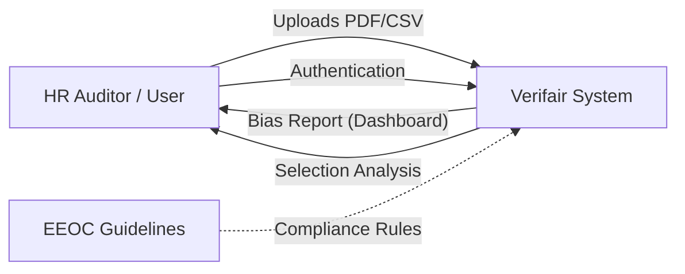
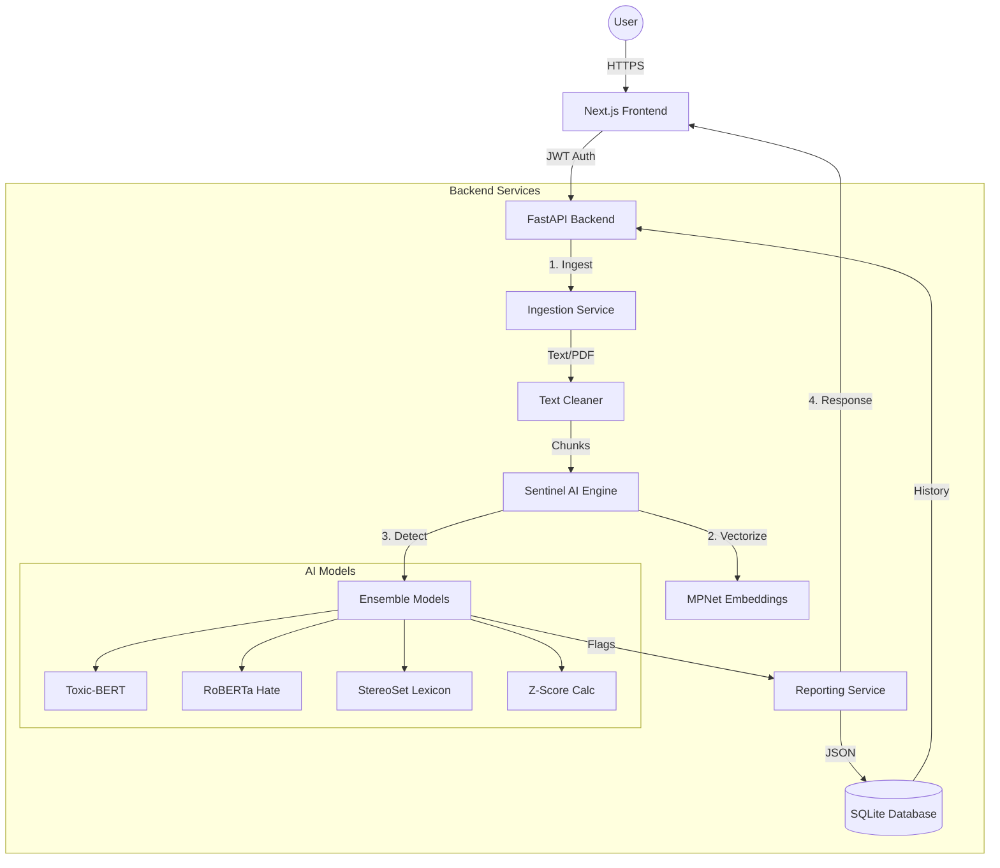
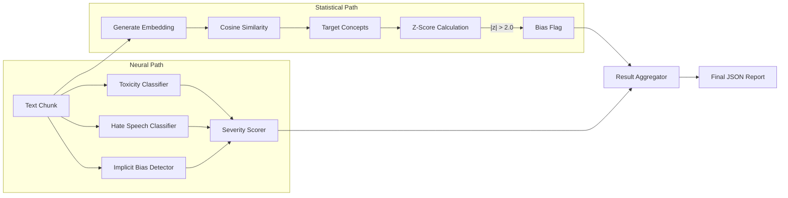

# Verifair System Architecture & Data Flow

## 📊 Data Flow Diagrams (DFD)

### Level 0: Context Diagram
*The high-level interaction between the User and the Verifair System.*

### Level 1: System Flow
*The core flow of data through the Backend API and AI Engine.*

### Level 2: Bias Detection Logic (Detailed)
*The internal physics of the Sentinel Engine.*

---

## 🏗️ Master Build Prompt (The "peokpt")
*Use this detailed prompt to instruct an AI or developer to build Verifair from scratch.*

**Role:** Expert Full-Stack AI Engineer
**Task:** Architecture & Development of "Verifair" - An AI Bias Audit Platform

**1. Core Objective:**
Build a secure, enterprise-grade web application to detect, quantify, and report on bias in unstructured text (PDFs) and structured selection data (CSVs). The system must use **latent semantic analysis** (not just keywords) and comply with **EEOC statistical standards**.

**2. Technology Stack:**
*   **Backend:** Python 3.10+, FastAPI (Async), Pydantic.
*   **Frontend:** Next.js 16 (App Router), TypeScript, Tailwind CSS v4.
*   **Database:** SQLite (local/dev) or PostgreSQL (prod) with SQLAlchemy ORM.
*   **AI/ML:** `sentence-transformers` (all-mpnet-base-v2), `pytorch`, `scikit-learn`, `scipy`.
*   **DevOps:** Docker Compose (multi-container), Github Actions.

**3. Key Features & Implementation Rules:**

*   **A. The "Sentinel" Engine (Text Bias):**
    *   Ingest PDFs/Text and chunk into 3-sentence windows.
    *   Generate embeddings using `all-mpnet-base-v2`.
    *   **Z-Score Analysis:** Compare chunk embeddings against "Identity Terms" (e.g., gender, race) and "Target Concepts" (e.g., unpleasant, incompetent). If statistical distance (Z-score) > 2.0, flag as biased.
    *   **Hate Speech Ensemble:** Implement a 3-layer check using:
        1.  `unitary/toxic-bert` (Toxicity)
        2.  `facebook/roberta-hate-speech` (Explicit Hate)
        3.  `toxigen_roberta` (Implicit/Coded Hate)
    *   **Stereotype Check:** Match against a lexicon of 13+ categories (Gender, Race, Age) using cosine similarity.

*   **B. Selection Bias Module (Structured Data):**
    *   Accept CSVs with columns: `Candidate_ID`, `Identity_Group`, `Selected (0/1)`.
    *   **Four-Fifths Rule:** Calculate selection rate for each group. If `(Minority Rate / Majority Rate) < 0.8`, flag as **EEOC Violation**.
    *   **Significance Testing:** Run a Chi-Square test (p < 0.05) to prove the disparity is not random.

*   **C. Frontend Dashboard:**
    *   **Design:** Glassmorphism, Dark/Light mode, "Apple-eque" aesthetic.
    *   **Visualizations:**
        *   **Bias Radar:** Radar chart showing bias intensity across 5+ identity axes.
        *   **Severity Gauge:** Real-time meter for the document's toxicity.
    *   **Interaction:** Drag-and-drop file upload, instant analysis results.

*   **D. Reporting:**
    *   Generate a "Collective Report" JSON for batch uploads.
    *   Include an "Fairness Score" (0-100) based on inverse bias frequency.

**4. Quality & Constraints:**
*   Code must be strictly typed (MyPy/TypeScript).
*   Use Async/Await for all I/O operations.
*   Include comprehensive logging (`logging.getLogger`).
*   Ensure the system can run offline (download models on first run).
